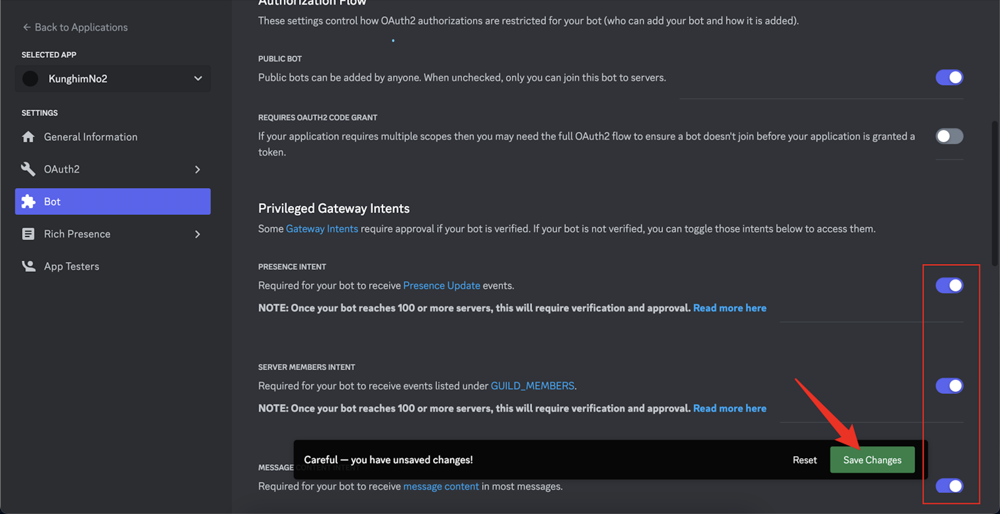
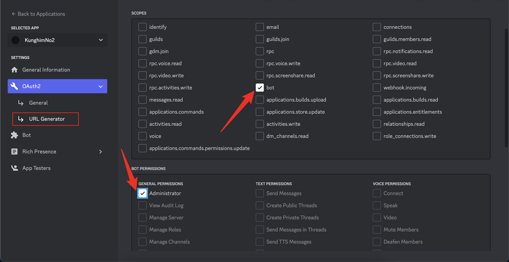
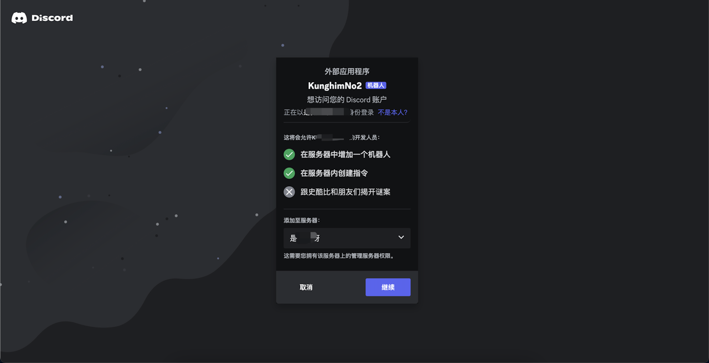
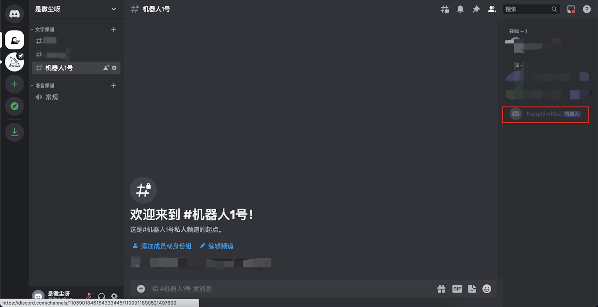

# go-kratos-discord

## Clone 项目
```
git clone https://github.com/kunghim/go-kratos-discord.git
```
## 修改配置文件
```
# Create a template project
server: 
  # discord 配置
  discord:
    # 用户 token
    user_token: xxx
    # 机器人 token
    bot_token: xxx
    # 服务器 id
    server_id: "101010"
    # 频道 id
    channel_id: "010101"
```

## 运行项目
需要科学上网，否则无法连接到 discord 机器人
```
server -conf ./configs
```
启动成功

在频道内发送和修改消息

服务器打印消息

## 项目拓展
项目内置新消息（CreateMessage）和修改（UpdateMessage）消息事件函数，可根据自己的需求进行拓展
```
// NewMessage 新消息事件（删除消息）
func NewMessage(s *discordgo.Session, m *discordgo.MessageDelete) {
    // TODO
}
```
新的消息事件函数需要在 server 中注册
```
// RegisterEvent 注册事件
func NewDiscordService(c *conf.Server, discordService *service.DiscordService) *DiscordServer {
	session, err := discordgo.New(fmt.Sprintf("Bot %s", c.Discord.BotToken))
	if err != nil {
		panic(err)
	}
	session.AddHandler(discordService.CreateMessage)
	session.AddHandler(discordService.UpdateMessage)
	// 注册新的消息事件
	session.AddHandler(discordService.Something)
	return &DiscordServer{
		discordService: discordService,
		session:        session,
	}
}
```

## 获取配置信息
### 1. 创建机器人
通过 https://discord.com/developers/applications 创建一个属于自己的机器人

输入机器人名称并接受开发者协议

创建成功后右边菜单栏选择 Bot，创建 token（请注意保管好自己的 token，勿在外网泄露！！！）

创建 token 完成后，下方即可为机器人开启相关事件权限

给机器人添加权限，选择 OAuth2 菜单栏，勾选 bot 权限和 adminstrator 权限。

拉倒最下面复制链接到浏览器打开，选择服务器，即可将机器人添加到服务器中


回到频道中就能看到刚刚创建的机器人了

### 2. 获取服务器 id 和频道 id
在 discord 中，选择要关联机器人的频道，复制链接，链接中的倒数第二串即为服务器 id，最后一串数字即为频道 id

### 3. 获取用户 token
在 discord 中，打开开发者工具，选择 Network 菜单栏，刷新页面，找到如下图所示的请求，点击请求，找到 Headers 菜单栏，找到 Request Headers 中的 Authorization 即为用户 token

